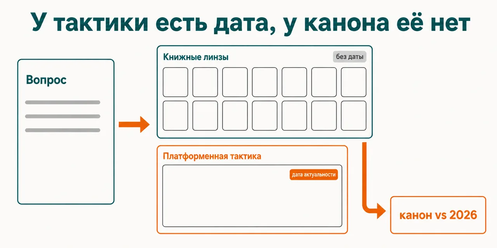
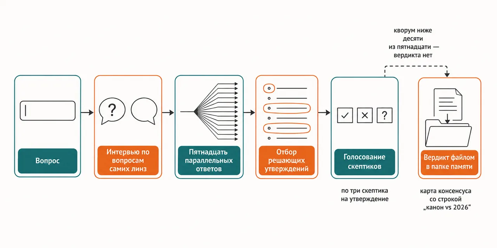

English · [Русский](README.md)

# Advice on getting known goes stale faster than you can act on it, and nobody stamped an expiry date on it

Fourteen book lenses each answer only from their own book, the platform tactics live in a
fifteenth lens carrying an as-of date, and any disagreement between the two reaches the verdict as
its own line: canon vs 2026.

```
claude plugin marketplace add https://github.com/beCyborg/jadlis-start.git
claude plugin install advisor-influence@jadlis
```

There are no keys, no paid services and no external CLIs here; the single setting is the folder the
council writes its verdicts, log and profile into.



In words: on the left a question about promotion, on the right the two layers of the roster — the
book one with no date, the platform one with a date — and an arrow from their disagreement into the
verdict line "canon vs 2026".

This is my workbench published as it is, not a product: whatever I stopped using, I removed.

## Before → after

| By hand | With an AI chat | With this plugin |
|---|---|---|
| **Where the advice comes from.** You take the book you read most recently and measure the whole launch by it. | It answers with all the books blended at once; which book a point came from is not visible. | Each lens reads its own book and answers only from it, and every point carries a citation tag of its own digest. |
| **The age of the advice.** The text never says which part is an evergreen principle and which is tactics for a dead platform. | The psychology of influence and this month's algorithm come out sounding equally confident. | The platform layer is a separate lens with a `data_as_of` field and a staleness threshold; the book lenses do not hand out platform tactics. |
| **What agreement between sources means.** When two sources line up it looks like confirmation. | Agreement inside one answer verifies nothing: there is a single source. | The lenses never see each other's answers; a curator picks the decisive claims and three skeptics vote on each. |
| **Where the contested part goes.** You have to come up with the objection yourself, usually later than you needed it. | No objection arrives: the answer fills the gap in instead. | Skeptics vote per claim: what is refuted never reaches "what to do", what is contested moves to the "against" side and is flagged on the consensus map. |
| **Where the analysis is half a year later.** In a chat thread you can no longer find. | Chat history is not sorted by topic and not tied to your context. | The verdict lands as a file in your memory folder, a line goes into the council log, and the council profile is updated for your next question. |

## How it works



Going in — your question plus the standing profile section that you maintain and the council only reads.
Inside — the lenses submit clarifying questions, an interview closes the unknowns, fifteen lenses
answer separately, a curator picks the decisive claims, and three skeptics vote on each of them.
Coming out — one file: what to do, a consensus map with a ledger column, a SWOT and the blind spots.

In words: question → an interview built from the lenses' own questions → fifteen parallel answers →
decisive claims selected → skeptics vote → a verdict written as a file in the memory folder.

Splitting the roster into two layers is the whole point of the setup. Fourteen lenses are books:
Cialdini, Hormozi, Godin, Heath, Berger, Miller, Kane, GaryVee, Kleon, Weinberg & Mares, Ferrazzi,
Schaefer, Flynn, Dunford. The fifteenth is "Tactics 2026": not a book but a synthesis of platform
research carrying `data_as_of: 2026-07` and a staleness threshold of 2027-01; past that threshold
the lens warns on its own that the data is more than half a year old and lowers confidence on the
platform-dependent tags.

Keeping the layers apart is the validator's protocol. Tactical questions — algorithms, formats,
channels, platform KPIs — are decided with the platform layer on top; questions of principle —
psychology, relationships, positioning, trust — with the book canon on top, and the platform layer
never rewrites the canon automatically. Any disagreement is required to appear on the consensus map
as a "canon vs 2026" line.

Discounting also applies to the books themselves: six lenses carry a known slant written into the
roster, and applying it is mandatory — Cialdini and Berger are read as a pre-algorithmic foundation
rather than tactics; Ferrazzi as principles of relationships, his channels belong to the offline era;
Hormozi applies to lead generation and monetisation, not to organic audience growth; Kane's
quantitative claims go out marked "the author's own estimate, not audited"; GaryVee's "be everywhere"
is discounted against the focus consensus. The discounts that fired are printed in the verdict header.

No verdict is issued below a quorum of ten out of fifteen: you get the lens answers as they are,
without synthesis. The opposite happens too — after the skeptics vote, nothing of the consensus may
survive; that is the answer "there are no grounds", not a breakage.

## Installing and the first run

**a) Text to paste to an agent.** Copy the whole thing into a Claude Code chat:

```
You are the installer. Install the plugin advisor-influence from the jadlis marketplace on this Mac.
Run exactly these commands, verbatim, shortening nothing:
1. claude plugin marketplace add https://github.com/beCyborg/jadlis-start.git
2. claude plugin install advisor-influence@jadlis
3. claude plugin list — show me the line about advisor-influence and its version.
The plugin needs no API keys and no external CLIs. It will ask for one setting, MEMORY_DIR, the
folder for the council's verdicts; I name the path myself, the default is ~/advisors-memory.
Before each command show it to me in full and wait for "yes". If I say "no", do not run it,
tell me what you skipped, and move on.
If a command returns an error, stop, show me the output, and do not move to the next one.
```

**b) Commands by hand.**

```
claude plugin marketplace add https://github.com/beCyborg/jadlis-start.git
claude plugin install advisor-influence@jadlis
claude plugin list
```

The first command installs nothing — it adds the marketplace. Only the second one installs, and one
line removes it: `claude plugin uninstall advisor-influence@jadlis --keep-data`.

You can set the memory folder right away: `claude plugin install advisor-influence@jadlis --config
MEMORY_DIR=~/advisors-memory`. It is shared across all Jadlis councils — one folder for all of them
is fine. The first run unpacks a skeleton into it: `Профили/`, `Журнал советов.md`,
`Журнал решений.md`, `Свайп-файл.md`, `Советы.md`; this council's verdicts go into the `Медийность`
subfolder, and the run's working files into `_runs`, which is removed once the verdict is written.
Changing the folder later means reinstalling with `--config`: on an already installed plugin that
flag silently changes nothing (checked 2026-09-07). Until the folder is set the council stops at the
gate and will not write a verdict into your current working directory.

**c) The short command.** Open Claude Code in the folder you work in and type:

```
/advisor-influence <your question>
```

If it is not found, check the name with `claude plugin list`. The council answers in the language of
your question; citation tags stay in English. The `## Profile` section of the profile file is yours
to maintain: the council reads it in full, never rewrites it and never asks again about what is
already there.

## Limits, cost, updating

**What it does not do.** It does not go online and does not check facts about your market: the lenses
answer from digests and hold no fresh data about your niche. It does not compute or supply numbers
for your channels — you bring those, and you mark their status yourself (fact, hypothesis, n=1), or
the skeptics will tear down the conclusion along with the unverified assumption underneath it. It
does not write your posts and landing pages — this is analysis, not a text pipeline. It does not pass
citation tags off as a bibliography: a tag points at a block of a digest inside the plugin, not at a
page of a book. It cannot be edited in place — the repository is assembled by a generator from a
private source and CI compares the content hash, so a file edit sent here will not survive a release;
found a problem, open an issue. It writes nothing outside your memory folder.

**What you need.** No keys: no API keys, no MCP servers, no paid services, no external binaries — the
script that unpacks the skeleton is `/bin/sh` and installs nothing. A Claude Code subscription: the
whole run comes out of your quota. And one setting, `MEMORY_DIR`, a folder on your own disk; the
default is `~/advisors-memory`.

[уточнить] — the repository fixes no date by which the platform layer will be refreshed: the
staleness threshold is stamped, the commitment to update is not.

**How tokens get spent.** A heavy run — dozens of subagents out of your quota: the interview harvest,
fifteen lenses in parallel, a curator, three skeptics per selected claim and the validator, all of
them on Opus at high effort. The council does not degrade partially: an exhausted session window
takes the whole fan-out down — every lens returns a refusal, the quorum is zero and there is no
verdict. So check what is left of the window before you start, and do not plan several councils
back to back inside one window. This is a tool for questions you do not get to replay.

**Verified where I work:** my Mac, my subscription. Where else this works — [уточнить].

**Terms of use.** There is no license: all rights reserved by the author. You may read it and use it
personally. Commercial use, republishing and bundling it into your own products — by arrangement
with me.

**Updating.** With a third-party marketplace, auto-update is off on your side: until you run the
first command you keep the version you installed.

```
claude plugin marketplace update jadlis
claude plugin update advisor-influence@jadlis
claude plugin list
```

Reinstall, if something ended up crooked:

```
claude plugin uninstall advisor-influence@jadlis --keep-data && claude plugin install advisor-influence@jadlis
```
